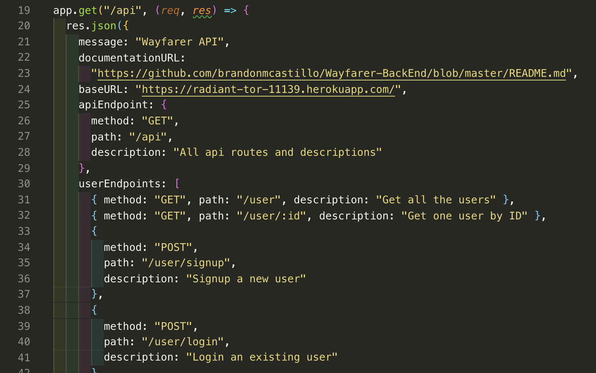
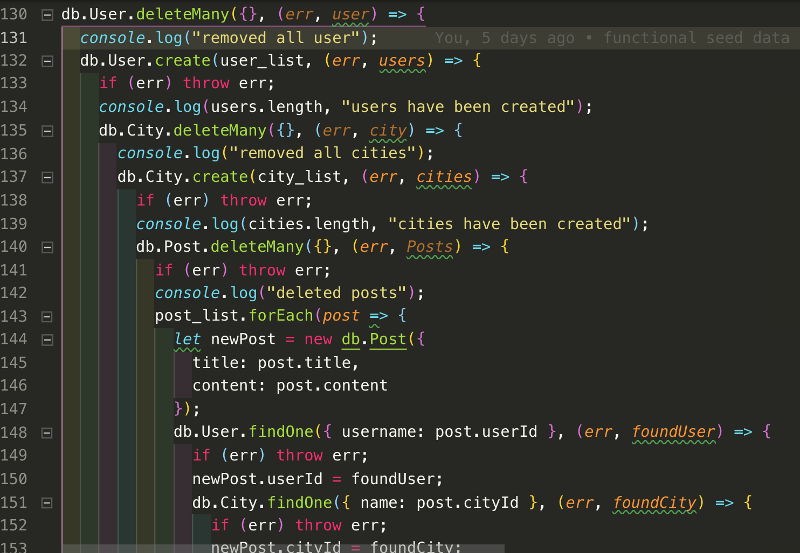

# Oasis-BackEnd
The back end section for our application Oasis that allows users to share tips (AKA posts) about their favorite locations around the world created by Brandon Castillo, Karma Drukpa, Amberly Wang and Michael Claus.
## API Endpoints
https://radiant-tor-11139.herokuapp.com/api
## Technologies Used
- Javascript
- Node.js
- Express
- Mongoose
## Our Process and Approach
The first stage of our process was to plan out how our schemas and models would be related. With this project, there were three entities: users, cities, and posts (made by users about cities). We initially thought about embedding the post data in the user and city. However, we realized this approach would not work since there wouldn't be a way to change the post data without accessing the post from the user and city. Thus we decided to reference the user and city inside the post.
 

 
Once we had the database planned out, we set up our file structure and implemented our schemas and models. We implemented the CRUD methods in controllers to keep separation of concerns. Once we had the CRUD methods implemented, we tested them on Postman to make sure they worked before connecting them to the front end of the application.
## Challenges and Wins
Some challenges we had were with implementing the user AUTH. We used user JavaScript Web Token AUTH to sign up and login users to our application.  Verifying a user is logged in was tricky since the React router is on the front end and JWT/bcrypt is on the back.
 
We also encountered problems as we were deploying our back end to heroku. There were some issues as we tried to push our app and pull our remote master.
## Code snippets

